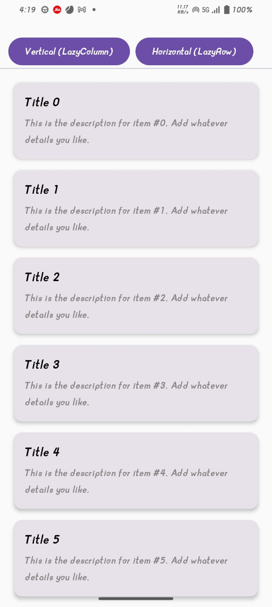
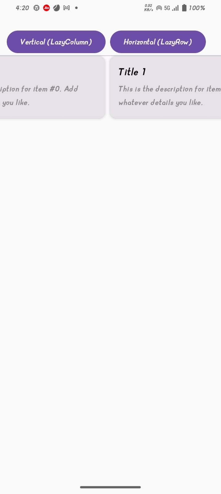

# 📰 Feed Screen App

A simple Android app built with Jetpack Compose to practice LazyRow and LazyColumn. The app displays a feed screen with 10 sample items, helping to understand how to build efficient scrollable lists in Compose.

# ✨ Features

Display of multiple items in a scrollable feed

LazyColumn for vertical lists

LazyRow for horizontal lists

Simple UI for learning list rendering

# screenshots

### LAZYROW SCREEN

### LAZYCOLUMN SCREEN

# 🛠️ Tech Stack

Kotlin

Jetpack Compose

Material 3 Components

# 🎯 Purpose

This project was created to learn and practice LazyRow and LazyColumn in Jetpack Compose for building smooth and performant list UIs.
